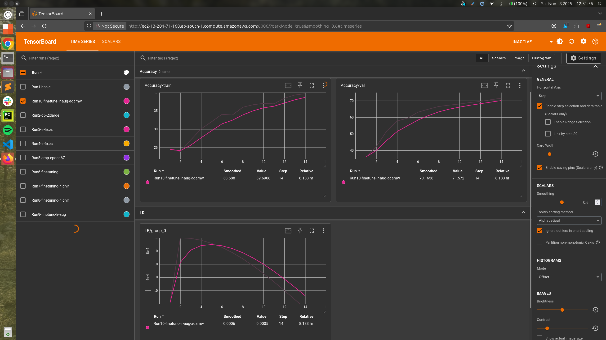

# ResNet50 Training Notes — ImageNet Experiments

## 1. Dry Run — Pipeline Check

**Instance:** `g4dn.xlarge`  
**Specs:** 4 vCPU, 16 GB GPU  
**Batch size:** 210 (256 caused OOM)  
**Workers:** 4  
**Epochs:** 2  
**Checkpoints:** Saved  

**Observations:**
- Dry run works fine.  
- Dataset loaded correctly, augmentations applied as expected.  
- Learning rate schedule behaving correctly.

---

## 2. Run1 — *basic*
**Name:** Run1-basic  
**Instance:** `g5.xlarge`  
**Specs:** 4 vCPU, 16 GB RAM, 24 GB GPU  
**Batch size:** 352 (failed for 384)  
**Workers:** 6  
**Epochs:** 70  
**Learning rate:** 0.001 (One Cycle LR)  
**Mixed precision:** ✅ Enabled  
**Checkpoints:** `/Data/checkpoints/Run1-basic`  

**Runtime Info:**
- Ran for 15 epochs before spot instance termination.  
- GPU utilization: ~11 GB (higher batch sizes caused CUDA OOM).  
- CPU utilization: >80% (load avg ~6).  
- Per-epoch training time: ~1 hour.

**Observations:**
- Validation accuracy was higher than training accuracy.  
- Model learning was very slow.  
- Suggest using larger instance, more workers, and slightly higher LR.

---

## 3. Run2 — *g5-2xlarge*
**Name:** Run2-g5-2xlarge  
**Instance:** `g5.2xlarge`  
**Specs:** 8 vCPU, 32 GB RAM, 24 GB GPU  
**Batch size:** 352  
**Workers:** 20  
**Epochs:** 70  
**Learning rate:** 0.001 (One Cycle LR)  
**Mixed precision:** Not specified  

**Fixes & Improvements:**
- On larger ec2 instance
- Same learning rate, some augmentation tweaks

**Observations:**
- Ran for 29 epochs before termination.  
- Model did not learn — *bad run.*

---

## 4. Run3 — *g5-2xlarge with higher lr* 
**Name**: Run3-g5-2xlarge-lr  
**Instance:** `g5.2xlarge`  
**Specs:** 8 vCPU, 32 GB RAM, 24 GB GPU  
**Batch size:** 352  
**Workers:** 16  
**Epochs:** 90 (ran for 10 epochs)  
**Learning rate:** 0.1 (One Cycle LR)  
**Mixed precision:** ✅ Enabled  

**Fixes & Improvements:**
- Higher LR and same augmentations

**Observations:**
- CPU utilization: >80% (load avg ~7).  
- GPU utilization: ~14 GB (higher batch sizes caused CUDA OOM).  
- Per-epoch training time: ~1 hour.
- Model’s validation accuracy did not improve.  
- Another bad run.  
- **Next steps:** Add diagnostics and recheck code.

---

## 5. Run4 — *lr-fixes*
**Name**: Run4-lr-fixes  
**Instance:** `g5.2xlarge`  
**Specs:** 8 vCPU, 32 GB RAM, 24 GB GPU  
**Batch size:** 176  
**Workers:** 16  
**Epochs:** 90 (ran for 66 epochs)  
**Learning rate:** 0.05  
**LR Schedule:** OneCycleLR (25% warmup, ~22 epochs)  
**Mixed precision:** ❌ Disabled  

**Fixes & Improvements:**
- Switched to **CrossEntropyLoss**.  
- Corrected **OneCycleLR** step when using batch accumulation.  
- Fixed augmentation parameters (GaussianBlur, CoarseDropout).  
- Added **gradient clipping** and better **diagnostic logs**.

**Observations:**
- With reduced LR and above fixes, model trained well.  
- ~40% validation accuracy in 30 epochs (during LR warmup).  
- Training slowed down after epoch 50.  
- Good gap between train and val accuracy due to heavy augmentations.
- Final metrics: At epoch 66, train accuracy=48%, val accuracy=55%

**Logs:**
[Training Logs](logs/imagenet/run4a-without-amp.log)

**In hindsight:**  
Should have started with higher LR = 0.1, fewer epochs (≈ 50), and longer warmup.

---

## 6. Run5 — *lr-fixes continuation*
**Name:** Run5-lr-fixes   
**Instance:** `g5.2xlarge`  
**Specs:** 8 vCPU, 32 GB RAM, 24 GB GPU  
**Batch size:** 352  
**Workers:** 16  
**Epochs:** 67 → 90 (resumed from previous run)
**Learning rate:** 0.05  
**LR Strategy:** OneCycleLR (25% warmup, ~22 epochs)  

**Fixes & Improvements:**
- Correct implementation of **mixed precision** (scaler updates)
- Switched to mixed precision for this run. Ensured scheduler continuity when resuming with OneCycle LR
- Added **Mixup** and **Cutmix** for refined training.  
- Added **label smoothing** in loss computation.
- Included additional augmentations: *ShiftScaleRotate*, *RandomBrightnessContrast*.

**Observations:**
- Continued training from previous checkpoints with optimizer/scheduler states.  
- No changes to learning rate or epochs, ensuring run can resume smoothly. Turning on mixed precision midway does not adversely affect the run
- Increased batch size improved training speed, but LR was decaying so learning was still slow  
- **Final validation accuracy:** **66% after 90 epochs.**

**Logs:**
[Training Logs](logs/imagenet/run5a-resume-with-amp.log)

**In hindsight:**  
This run and the previous run should have been combined into a single run of 50 epochs,  with LR = 0.1 and mixed precision. Heavier augmentations (Cutmix and Mixup) should have been added from the start.

**Tensorboard Train/Val Accuracy Graphs**  

---

## 7. Run6 to 10 - Finetuning trial runs
**Instance:** `g5.2xlarge`  
**Specs:** 8 vCPU, 32 GB RAM, 24 GB GPU  
**Batch size:** 352/368/384
**Workers:** 8/12/16
**LR Strategy:** LinearLR (2 epochs) → CosineAnnealingLR  
**Optimizer:** SGD, AdamW

These runs were to try and reduce per-epoch runtime from 1 hour to ~35-40 mins. Also to find a decent learning rate for finetuning, as well as finalize the optimizer/scheduler

**Fixes & Improvements:**
- Load dataset to Ec2 instance's NVMe volume, instead of on the external EBS volume
- Install Pillow-simd version
- Set persistent workers to true

**Observations:**
- Training time per epoch reduced from 1 hour to **37 minutes**
- GPU utilization ~100%, GPU memory utilization ~19GB out of 24GB. CPU utilization ~50%-60%
- Attaching the external /Data ebs volume and using it directly caused the major IO bottleneck. Imagenet data should be copied over to the g5.2xlarge instance's SSD drive, which has higher throughput
- Lesser number of dataloader workers actually speeds up the process
---

## 8. Run10 - Finetuning
**Name:** Run10-finetune-lr-aug-adamw
**Instance:** `g5.2xlarge`  
**Specs:** 8 vCPU, 32 GB RAM, 24 GB GPU  
**Batch size:** 368  
**Workers:** 12  
**Epochs:** 25  
**Learning rate:** 0.001  
**LR Strategy:** LinearLR (2 epochs) → CosineAnnealingLR  
**Optimizer:** AdamW  

**Fixes & Improvements:**
- Short fine-tuning run to push validation accuracy higher.
- Switched optimizer to **AdamW**
- Switched LR scheduler to CosineAnnealingLR
- Used **lighter augmentations** with lower probabilities; Mixup/Cutmix reduced to 0 near end.
- Added more diagnostics for CPU/GPU utilization. 
- Attempted **EMA** for validation loss tracking — implementation incorrect, caused issues.
- Val Acc: **74.75%** 

**Logs:**
[Training Logs1](logs/imagenet/run10b.log)   
[Training Logs2](logs/imagenet/run10c.log)   
[Training Logs Final](logs/imagenet/run10d.log)    

**Tensorboard Train/Val Accuracy Graphs**  

---

## 📊 Summary Table

| Run Name                    | Instance | Batch Size | LR | Epochs (ran) | Mixed Precision | Final Val Acc | Notes                          |
|-----------------------------|-----------|-------------|---|---------------|------------------|-----------|--------------------------------|
| Dry Run                     | g4dn.xlarge | 210 | — | 2 | ❌ | —         | Pipeline check only            |
| Run1-basic                  | g5.xlarge | 352 | 0.001 | 15/70 | ✅ | —         | Slow learning, val > train acc |
| Run2-g5-2xlarge             | g5.2xlarge | 352 | 0.001 | 29/70 | — | —         | Model didn’t learn             |
| Run3-g5-2xlarge-lr          | g5.2xlarge | 352 | 0.1 | 10/90 | ✅ | —         | Bad run                        |
| Run4-lr-fixes               | g5.2xlarge | 176 | 0.05 | 66/90 | ❌ | ~40% (at 30 epochs) | Training improved after fixes  |
| Run5-lr-fixes               | g5.2xlarge | 352 | 0.05 | 90 | ✅ | **66%**   | Mixup, Cutmix, label smoothing |
| Run10-finetune-lr-aug-adamw | g5.2xlarge | 368 | 0.001 | 25 | ✅ | **74.75%** | AdamW optimizer, lighter aug   |
| Run11-more-finetune | g5.2xlarge | 368 | 5e-5 | 5 | ✅ |           | Mini run, very low LR          |
---

## Final notes and learnings
- Log diagnostics right from the beginning
- Use less dataloaders, CPU need not be maxed out
- Pick batch size where GPU is fully u
- Pick right instance and use the server's volume for dataset
- 
